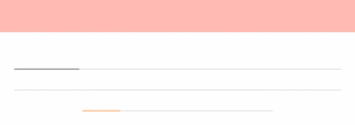
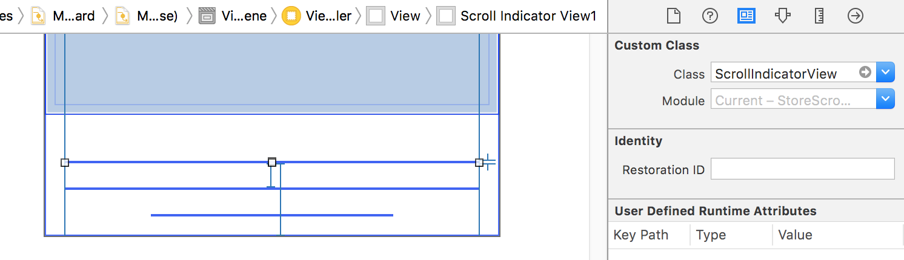

# StoreScrollIndicator
A paging indicator like Apple Store app.




Apple Store App:


# Requirement

- iOS 9.3 and later
- Swift 4.2
- Xcode 8 (Sample Project)

# Usage

## 1. Copy ScrollIndicatorView.swift to your project

- `ScrollIndicatorView.swift`
- `StackedIndicatorView.swift`
	- Stacked style

## 2. Put the ScrollIndicatorView / StackedIndicatorView

Put the custom view on a nib, then set Class as `ScrollIndicatorView` or `StackedIndicatorView`.



Also initializable from your code.

## 3. Set properties

```
scrollIndicatorView.numberOfPages = 5
scrollIndicatorView.style = .marker   // Marker Style
scrollIndicatorView.style = .progress // Progress Style
scrollIndicatorView.style = .autoProgress // Timer Style
scrollIndicatorView.indicatorColor = UIColor.orange // Indicator Color
```

## 4. Implement UIScrollViewDelegate

- To fade in effect
	- scrollViewDidScroll()
- To fade out effect
	- scrollViewDidEndDragging()
	- scrollViewDidEndDecelerating()
	- scrollViewDidEndScrollingAnimation()

```
func scrollViewDidScroll(_ scrollView: UIScrollView){
	scrollIndicatorView.scrollToOffsetOf(scrollView: scrollView)
	
	if scrollView.isTracking || scrollView.isDragging {
		scrollIndicatorView.fadeIn()
	}
}

func scrollViewDidEndDragging(_ scrollView: UIScrollView, willDecelerate decelerate: Bool) {
	scrollIndicatorView.fadeOut()
}

func scrollViewDidEndDecelerating(_ scrollView: UIScrollView) {
	scrollIndicatorView.fadeOut()
}

func scrollViewDidEndScrollingAnimation(_ scrollView: UIScrollView) {
	scrollIndicatorView.fadeOut()
}
```

# License

See [LICENSE](LICENSE) (MIT) for details. 